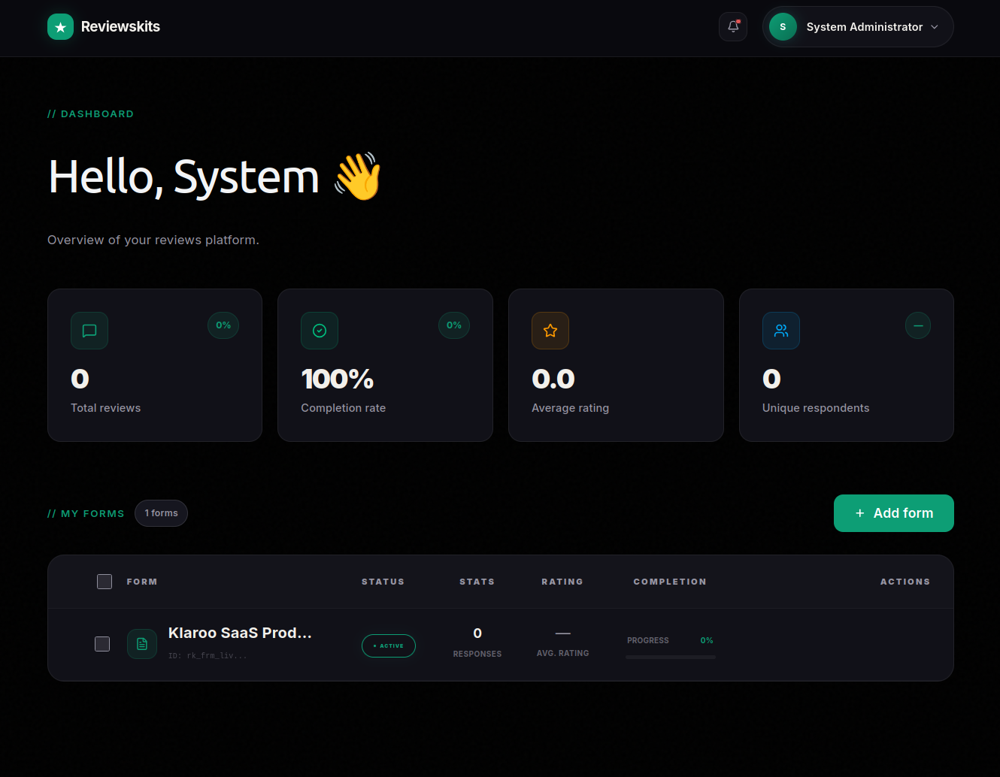
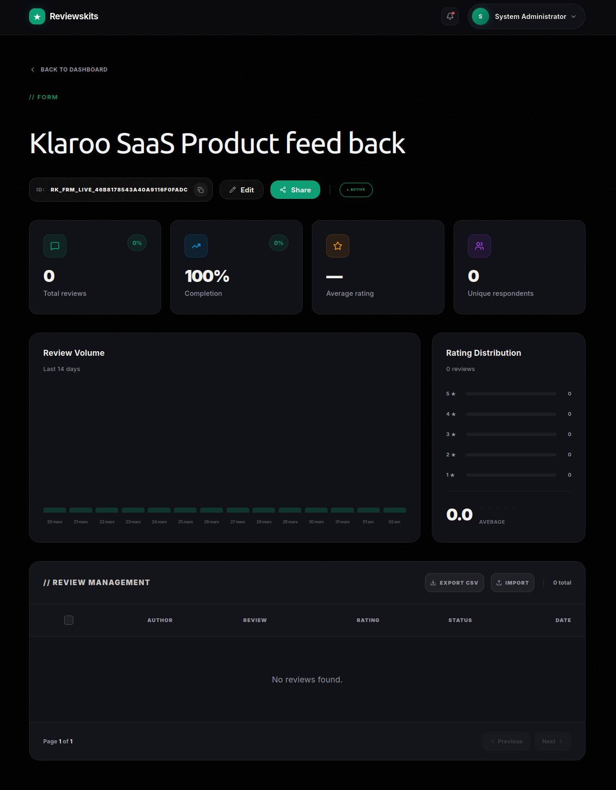
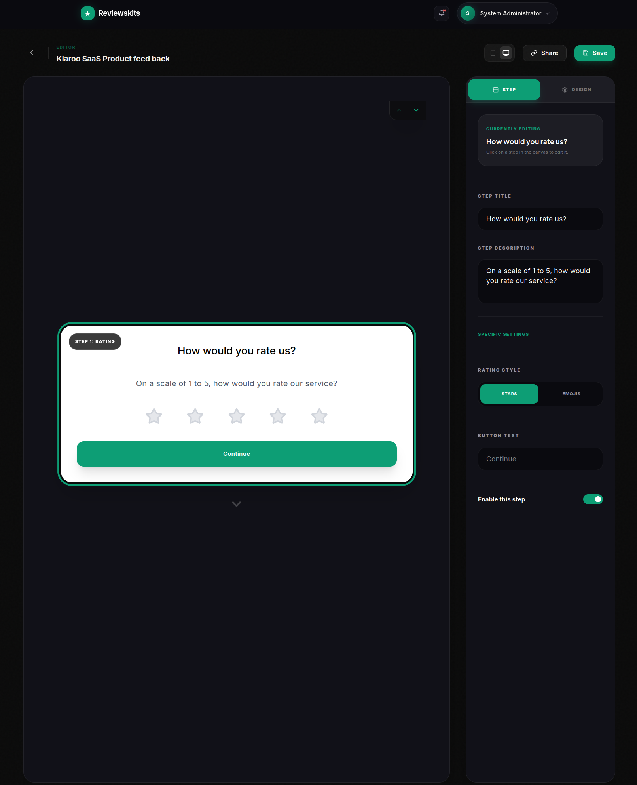
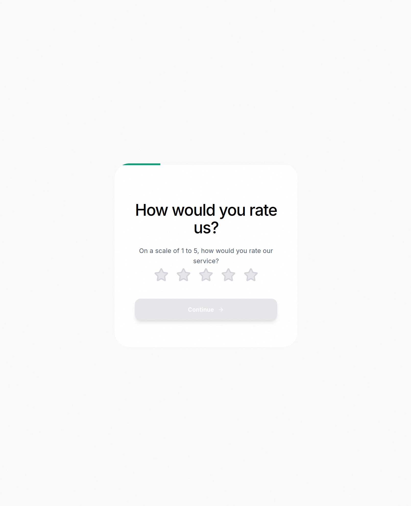

<p align="center">
  <a href="https://github.com/reviews-kits-team/reviews-kits">
    
  </a>
</p>

<h1 align="center">Reviewskits</h1>

<p align="center">
  <strong>The Open Source, Self-Hosted Alternative to Senja.</strong><br />
  Collect, moderate, and display customer reviews with a powerful headless API.<br />
  <em>Your data. Your infrastructure. Your design.</em>
</p>

<p align="center">
  <a href="https://docs.reviewskits.com"><strong>📖 Documentation</strong></a> ·
  <a href="https://reviewskits.com"><strong>🌐 Website</strong></a> ·
  <a href="https://github.com/reviews-kits-team/reviews-kits/issues/new?labels=bug"><strong>🐛 Report Bug</strong></a> ·
  <a href="https://github.com/reviews-kits-team/reviews-kits/issues/new?labels=feature-request"><strong>💡 Request Feature</strong></a> ·
  <a href="https://github.com/reviews-kits-team/reviews-kits/issues?q=label%3A%22good+first+issue%22"><strong>🙌 Good First Issues</strong></a>
</p>

<p align="center">
  <a href="https://github.com/reviews-kits-team/reviews-kits/blob/main/LICENSE">
    
  </a>
  <a href="https://github.com/reviews-kits-team/reviews-kits/stargazers">
    
  </a>
  <a href="https://twitter.com/reviewskits">
    
  </a>
  <a href="https://github.com/reviews-kits-team/reviews-kits/issues?q=label%3A%22good+first+issue%22+is%3Aopen">
    
  </a>
</p>

<p align="center">
  
  
  
  
  
  
  
  
  
  
</p>

> **If Reviewskits saves you time or replaces a paid tool — a ⭐ means the world to us and helps other developers discover the project!**

---

## 📸 See it in action

<table>
  <tr>
    <td align="center" width="50%">
      <strong>📋 Dashboard — Manage your forms</strong><br /><br />
      
    </td>
    <td align="center" width="50%">
      <strong>📊 Analytics — Stats & collected reviews</strong><br /><br />
      
    </td>
  </tr>
  <tr>
    <td align="center" width="50%">
      <strong>🎨 Form Builder — Design your multi-step form</strong><br /><br />
      
    </td>
    <td align="center" width="50%">
      <strong>✨ Live Form — The respondent's experience</strong><br /><br />
      
    </td>
  </tr>
</table>

---

## 🤔 Why Reviewskits?

Platforms like Senja, Testimonial.to, or Trustpilot charge monthly fees, lock your data in their cloud, and dictate how your reviews look. **Reviewskits is different.**

| | Reviewskits | Senja / Testimonial.to |
|---|---|---|
| 💰 Cost | **Free & Open Source** | $29–$99/month |
| 🏠 Data ownership | **Your servers** | Their cloud |
| 🎨 UI freedom | **100% headless** | Limited widgets |
| 🔌 API access | **Full REST API** | Restricted |
| 🔧 Customization | **Unlimited** | Template-based |
| 🔒 Privacy | **GDPR on your terms** | Shared infrastructure |

---

## 🚀 Features

- **📲 Customizable Forms** — Create conversion-optimized multi-step forms with custom fields and full branding control.
- **⚖️ Clean Moderation** — Approve or reject reviews in seconds from a unified admin dashboard.
- **📦 Headless SDKs** — First-class support for React, Next.js, Vue, and Nuxt with zero-dependency packages.
- **🔑 API-First** — Every feature is accessible via a secure REST API with Public & Admin key scopes.
- **🔒 Self-Hostable** — One `docker compose up` and you're live. No external dependencies, no mandatory cloud accounts.
- **⚡ Built for speed** — Powered by Hono on Bun. Handles thousands of requests per second on minimal hardware.
- **🌍 Multi-form** — Manage unlimited forms and projects from a single instance.
- **📊 Analytics** — Track response rates, review trends, and form performance out of the box.

---

## 🛠️ Tech Stack

Reviewskits is built on a modern, fully type-safe stack — no legacy, no bloat:

| Layer | Technology |
|---|---|
| Runtime | [Bun](https://bun.sh/) |
| Language | [TypeScript](https://www.typescriptlang.org/) |
| Backend API | [Hono](https://hono.dev/) |
| Frontend (Admin) | [React](https://reactjs.org/) + [TailwindCSS](https://tailwindcss.com/) + [shadcn/ui](https://ui.shadcn.com/) |
| Database | [PostgreSQL](https://www.postgresql.org/) + [Drizzle ORM](https://orm.drizzle.team/) |
| Auth | [Better-Auth](https://better-auth.com/) |
| Infra | [Docker](https://www.docker.com/) + Redis + Minio |
| Docs | [VitePress](https://vitepress.dev/) |

---

## 🏁 Getting started in 3 steps

### 🐳 Self-host with Docker Compose

```bash
# 1. Clone the repo
git clone https://github.com/reviews-kits-team/reviews-kits.git
cd reviews-kits

# 2. Configure environment
cp .env.example .env
# → Fill in ADMIN_EMAIL, ADMIN_PASSWORD, DATABASE_URL

# 3. Launch 🚀
docker compose -f infra/docker-compose.yml up -d
```

That's it. Open `http://localhost:3000` and start collecting reviews.

### ☁️ Cloud Version
A managed hosted version is on the way for those who prefer not to manage infrastructure. [Watch the repo](https://github.com/reviews-kits-team/reviews-kits/subscription) to be notified at launch.

---

## 👨‍💻 Local Development

### Prerequisites
- [Bun](https://bun.sh/)
- [Docker](https://www.docker.com/) (for Postgres, Redis, Minio)

```bash
# Install dependencies
bun install

# Start infrastructure
docker compose -f infra/docker-compose.dev.yml up -d

# Run dev server
bun run dev
```

---

## 🙌 Contributing

Contributions are what make open source great. Here's how you can help:

- **⭐ Star this repo** — it helps more developers discover Reviewskits.
- **🐛 Report bugs** — [open an issue](https://github.com/reviews-kits-team/reviews-kits/issues/new?labels=bug) with as much detail as possible.
- **💡 Request features** — [share your ideas](https://github.com/reviews-kits-team/reviews-kits/issues/new?labels=feature-request), we read every one.
- **👩‍💻 Submit a PR** — check out [good first issues](https://github.com/reviews-kits-team/reviews-kits/issues?q=label%3A%22good+first+issue%22+is%3Aopen) to get started without diving into the whole codebase.

Please read [CONTRIBUTING.md](./CONTRIBUTING.md) before opening a pull request. All skill levels are welcome.

---

## 📆 Contact

Have a question, a partnership idea, or want to chat?

[📅 Book a call on Cal.com](https://cal.com/reviewskits) · ✉️ `hello@reviewskits.com`

---

## 🔒 Security

Security issues should be disclosed responsibly. Please **do not** open a public issue — instead, send an email to `security@reviewskits.com`. See [SECURITY.md](./SECURITY.md) for details.

---

## 👩‍⚖️ License

**Reviewskits Core** is licensed under the [AGPLv3 Open Source License](./LICENSE) — free to use, self-host, and modify.

**Enterprise Edition** — additional features for larger teams are available under a commercial license. See [COMMERCIAL_LICENSE.md](./COMMERCIAL_LICENSE.md) or our [License docs](https://docs.reviewskits.com/guide/license).

White-labeling is not currently offered. Other licensing needs? Email `hello@reviewskits.com`.

---

<p align="center">
  Made with ❤️ by the <a href="https://github.com/reviews-kits-team">Reviewskits team</a> and <a href="https://github.com/reviews-kits-team/reviews-kits/graphs/contributors">contributors</a>
  <br /><br />
  <a href="#-reviewskits">🔼 Back to top</a>
</p>
