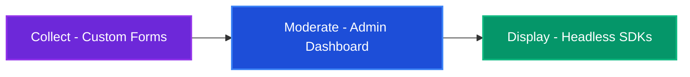

# What is Reviewskits?

Reviewskits is the **Open-Source, Self-Hosted alternative to Senja**. It's an API-first, headless testimonial engine designed for developers who want total control over their data and their design.

Collect customer testimonials via customizable forms, moderate them from a clean dashboard, and display them anywhere using our SDKs — with zero imposed UI.

---

## How it Works

The Reviewskits workflow is designed to be simple, efficient, and fully under your control.

1.  **Collect**: Create a form, share the link, and let your customers leave reviews.
2.  **Moderate**: Review, approve, or reject submissions from your private dashboard.
3.  **Display**: Fetch approved reviews via our React/Vue SDKs and style them your way.

---

## Core Features

::: info 🚀 Built for Speed and Privacy
Reviewskits is powered by **Hono** and **Bun** for extreme performance and is designed to be **Self-Hosted** from day one.
:::

| Feature | Description |
|---|---|
| **Headless Architecture** | No forced widgets or iframes. You get raw data (JSON), you provide the CSS. |
| **API-First** | Everything is accessible via a secure REST API with Public/Secret key protection. |
| **Smart Forms** | Conversion-optimized, customizable collection forms with zero lock-in. |
| **Moderation Panel** | A clean, minimalist dashboard to manage your "Wall of Love" in seconds. |
| **Zero-Dep SDKs** | Official, lightweight packages for React, Next.js, Vue, and Nuxt 3. |
| **GDPR Ready** | Your data stays on your server. No third-party tracking or data selling. |

---

## Why Choose Reviewskits?

*   **Own Your Data**: Stop paying monthly fees to store your own testimonials.
*   **Total Design Freedom**: Build a wall of love that actually matches your site's brand.
*   **Developer First**: Type-safe, high-performance, and easy to integrate into any stack.

---

## Ready to start?

If you're ready to take control of your social proof, follow the guides below:

👉 [**Install Reviewskits (Get Started)**](/guide/getting-started)
👉 [**Explore the React SDK**](/sdk/react)
👉 [**Explore the Vue SDK**](/sdk/vue)
